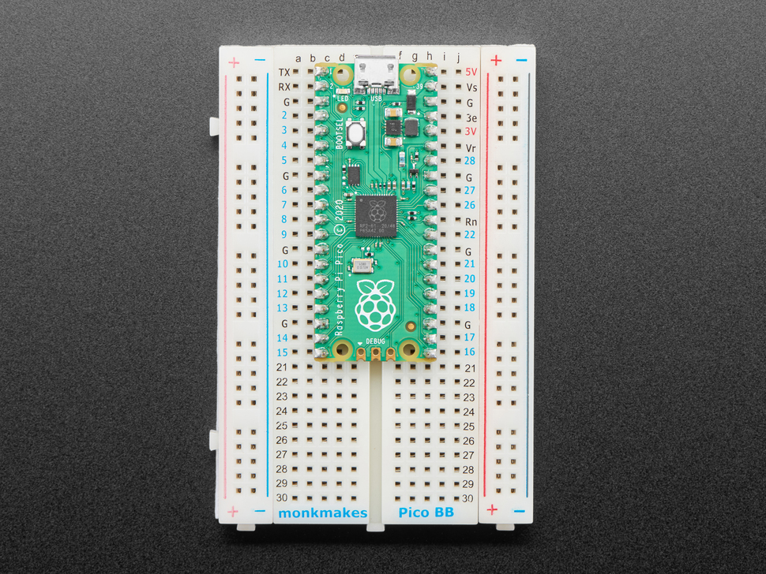
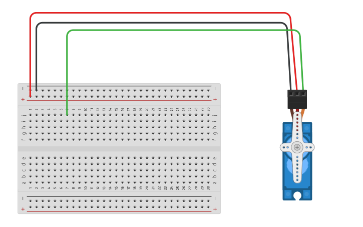
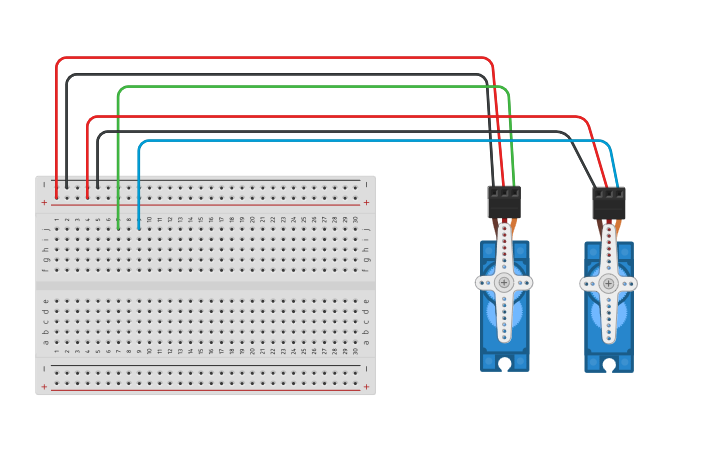
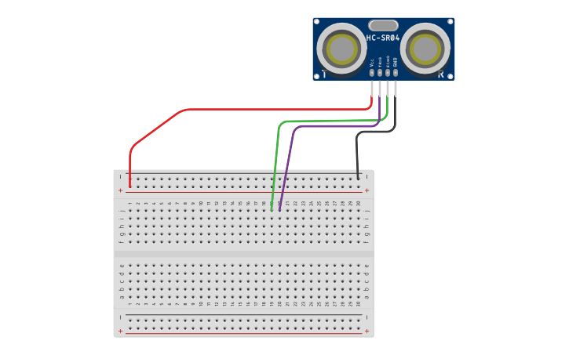
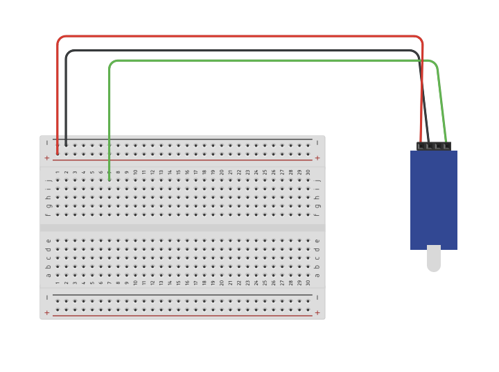

# pi pico examples

## code examples

### servo.py

This code demonstrates how to control an SG90 servo motor using a Raspberry Pi Pico. It utilizes the Servo library to simplify the servo control process. The code continuously rotates the servo between 0° and 90° positions with a short delay in between, providing a basic example of servo motor control.

#### Things to try/modify:

- Adjust the servo rotation angles
- Change the delay between servo rotations
- Add more servo positions

### sensor.py

This code reads an analog sensor value and prints it to the command line every 0.3 seconds. It sets up an analog input pin, reads the sensor value as a 16-bit unsigned integer, and displays it. This allows monitoring the sensor's output and can be adapted for various sensors and projects.

#### Things to try/modify:

- Change the analog input pin
- Adjust the delay between sensor readings
- Modify the output format

### ultra-sound.py

This code demonstrates how to use an ultrasonic distance sensor (HC-SR04) with a microcontroller board (like a Raspberry Pi Pico). It continuously measures the distance between the sensor and the nearest object in front of it. The measured distance is displayed in centimeters (cm) every 0.3 seconds.

#### Things to try/modify:

- Adjust the trigger and echo pin assignments
- Change the delay between distance measurements
- Modify the distance calculation formula

### library.py

Contains important code resources. Do not touch!

## wiring

### pinout pi pico

**⚠️ Make sure the pi pico is placed on the breadboard like below ⚠️**

### single servo

### multiple servos

### ultrasonic sensor

### light sensor

