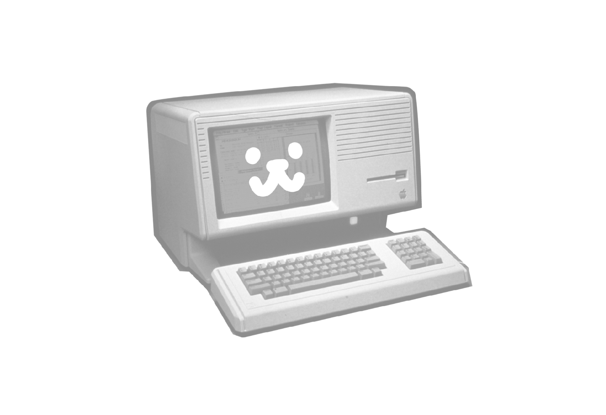
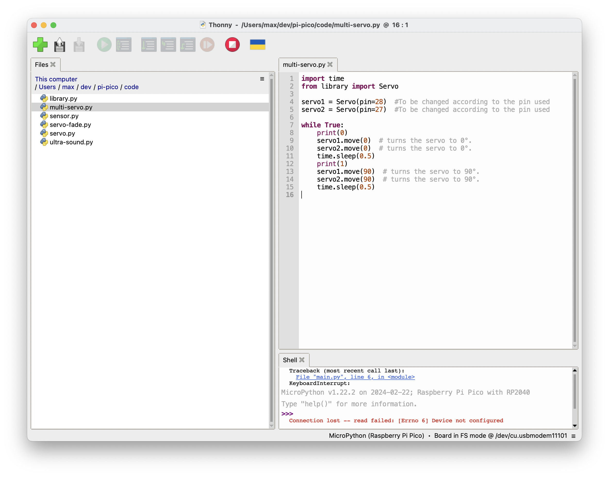
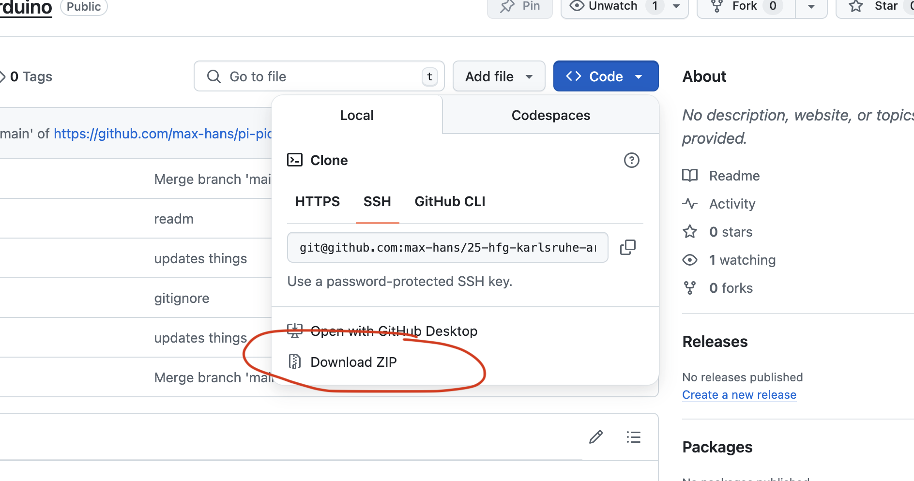
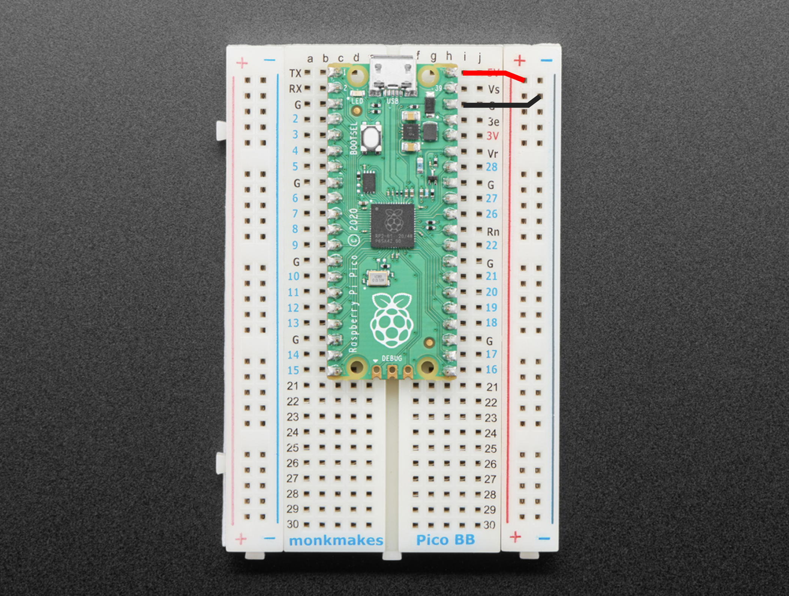

# "Ubiquitous Computing" Course Material

Summer Semester 25, HfG Karlsruhe

Maximilian Hans

Contact: main@i-like-robots.com



## Resources

- <a href="https://raw.githubusercontent.com/max-hans/25-hfg-karlsruhe-arduino/refs/heads/main/resources/1-intro.pdf" class="image fit">01-intro</a>
- <a href="https://raw.githubusercontent.com/max-hans/25-hfg-karlsruhe-arduino/refs/heads/main/resources/2-inspiration.pdf" class="image fit">02-inspiration</a>
- <a href="https://github.com/max-hans/25-hfg-karlsruhe-arduino/archive/refs/heads/main.zip">Download all files</a>
- [MicroPython Reference](https://docs.micropython.org/en/latest/rp2/quickref.html)

## Introduction

### Thonny

You will need Thonny to run and upload your Python code. Get it [here](https://thonny.org/).



### Getting All the Data

**1. Download the Contents of This Repository**

Click on 'Download .ZIP'



## Python Basics

You can find a list of examples and descriptions on how Python code actually works [here](/python.md)

## Code Examples

Code examples can be found in the ["code"](/code) directory.

### basics.py

This code teaches the basics of Python programming including variables, if-statements and loops. Try this first!

### servo.py

This code demonstrates how to control an SG90 servo motor using a Raspberry Pi Pico. It utilizes the Servo library to simplify the servo control process. The code continuously rotates the servo between 0° and 90° positions with a short delay in between, providing a basic example of servo motor control.

#### Things to Try/Modify:

- Adjust the servo rotation angles
- Change the delay between servo rotations
- Add more servo positions

### servo-fade.py

This code demonstrates how to control an SG90 servo motor using a Raspberry Pi Pico and the Servo library. The code continuously rotates the servo between 0° and 90° positions in steps of 5°, creating a fading effect.

#### Things to Try/Modify:

- Adjust the servo rotation angles
- Change the delay between servo rotations
- Add more servo positions

### sensor.py

This code reads an analog sensor value and prints it to the command line every 0.3 seconds. It sets up an analog input pin, reads the sensor value as a 16-bit unsigned integer, and displays it. This allows monitoring the sensor's output and can be adapted for various sensors and projects.

#### Things to Try/Modify:

- Change the analog input pin
- Adjust the delay between sensor readings
- Modify the output format

### ultra-sound.py

This code demonstrates how to use an ultrasonic distance sensor (HC-SR04) with a microcontroller board (like a Raspberry Pi Pico). It continuously measures the distance between the sensor and the nearest object in front of it. The measured distance is displayed in centimeters (cm) every 0.3 seconds.

#### Things to Try/Modify:

- Adjust the trigger and echo pin assignments
- Change the delay between distance measurements
- Modify the distance calculation formula

### library.py

Contains important code resources. Do not touch!

## Wiring

### Pinout Pi Pico


**⚠️ Make sure the Pi Pico is placed on the breadboard like below ⚠️**



### Single Servo


### Multiple Servos


### Ultrasonic Sensor


### Light Sensor


## Prompting

When using ChatGPT or other GenAi to work on your code, integrate the following in your prompt:

```
<context>
we are using microphyton on a pi pico. make the code as simple as possible.
dont use any fancy python functionality. dont use defs/functions, consts, type annotations, records or array.
dont rewrite the code from ground up.
use only the libraries: "time" and "machine".
the code should be verbose without making things too complex. dont add extraneous comments. the code should explain itself.
if something is unclear (pins, timeframes etc) – ask before creating the code.

The pi pico has 28 GPIO pins going from GP0 to GP28. GP23-GP25 are NOT available.
GP26, GP27 and GP28 can also be used as ADC.
</context>
```
